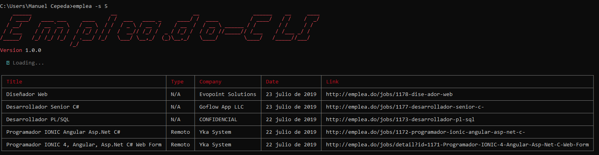
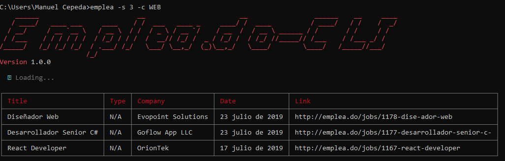

# empleado-cli

[](https://www.npmjs.com/package/empleado-cli)
[](https://www.npmjs.com/package/empleado-cli)


For those whom do not like to leave the terminal.

## Installation

```bash
$ npm install -g empleado-cli
# or
$ yarn global add empleado-cli
```

## Usage

```bash
$ emplea [options] [arguments]
```

## Options

|Option         |Description            |
|---------------|-----------------------|
|-c, --category |the category of the jobs, currently available `MOBILE`, `SOFTWARE`, `SYSADMIN`, `TELNET`, `WEB` | 
|-h, --help     |print emplea command line options |
|-s, --size     |the size of the job list          |
|-p, --page     |the page                          |

## Example

```bash
# Find the latest 5 jobs in the list
$ emplea -s 5
```


```bash
# Find the latest 3 jobs from the category WEB
$ emplea -s 3 -c WEB
```

